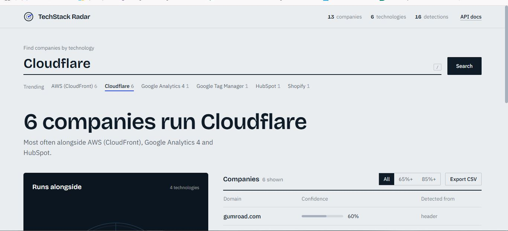
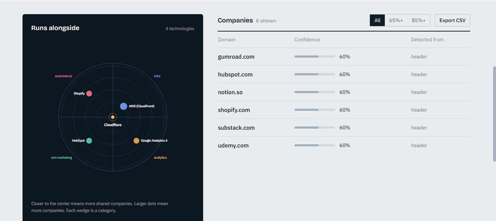
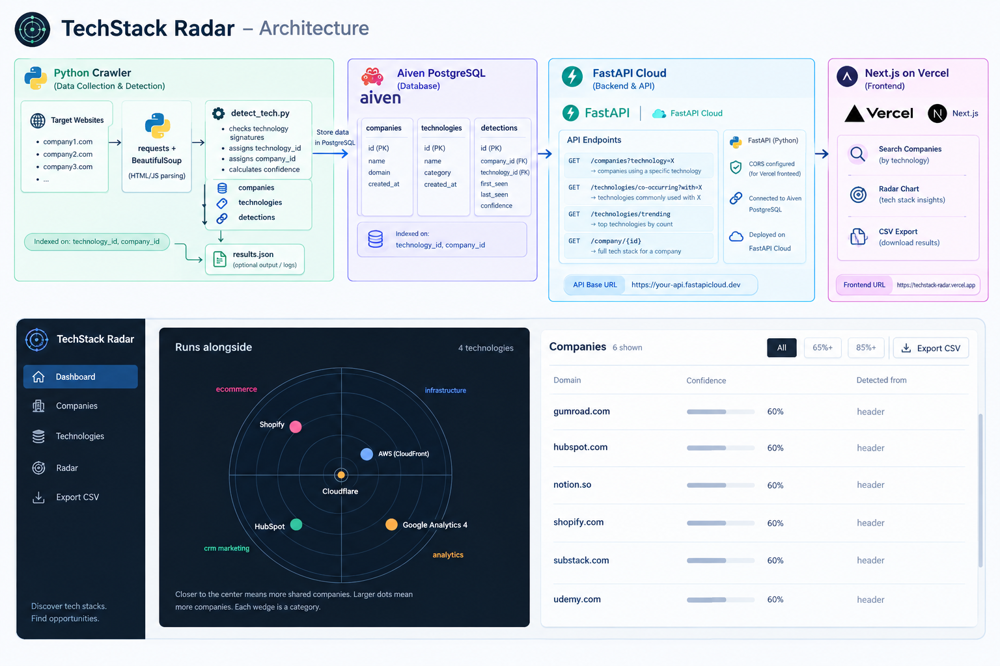
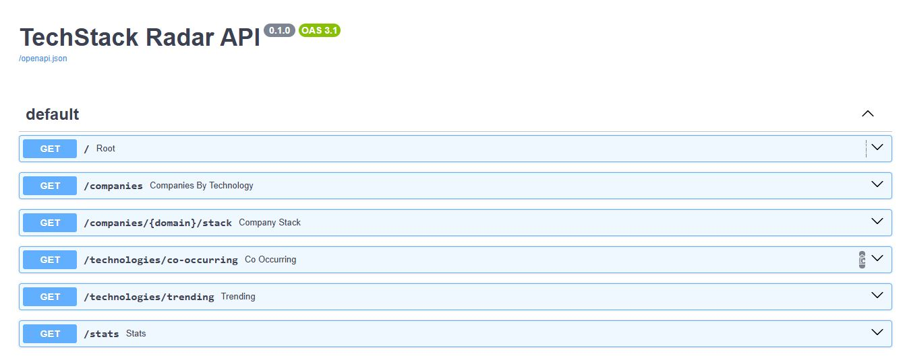
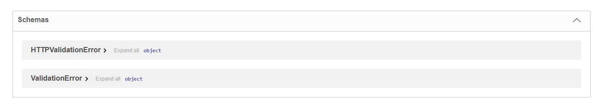

# TechStack Radar

A scoped-down version of what MixRank does: crawl company websites, detect what technologies they run, structure the results into a queryable database, and expose it as a searchable product for sales and marketing teams.

[](https://techstack-radar1.vercel.app)
[](https://techstack-radar.fastapicloud.dev/docs)
[](https://www.python.org/)
[](https://fastapi.tiangolo.com/)
[](https://nextjs.org/)
[](https://www.postgresql.org/)

---

## Dashboard

Live dataset: **13 companies · 6 technologies · 16 detections.**





---

## Why this project

I built this because I wanted to understand what MixRank actually *is* — not just "a company data platform" but the specific pipeline: **crawl → detect → structure → query**. So I rebuilt a 1/1000th-scale version end to end.

Every design decision maps directly to the real product:

| This repo | MixRank's actual product |
|-----------|--------------------------|
| `detect_tech.py` — regex signature matching | Core detection engine (the moat) |
| `detections` table with `first_seen` / `last_seen` | Freshness tracking for sales signals |
| `/technologies/co-occurring?with=X` | "Companies using X also use Y" — sales lead-gen insight |
| Weekly re-crawl via systemd timer | Keeping data fresh at scale |

---

## Architecture

```
     [ Python crawler ]              [ Aiven PostgreSQL ]
     detect_tech.py           →      companies · technologies · detections
     requests + BeautifulSoup        indexed on (technology_id, company_id)
              │                                │
              ▼                                ▼
       [ results.json ]              [ FastAPI · FastAPI Cloud ]
                                        /companies?technology=X
                                        /technologies/co-occurring?with=X
                                                  │
                                                  ▼
                                       [ Next.js · Vercel ]
                                Search · radar chart · CSV export
```



**Stack** (all five technologies from the job description):

- **Python 3.10** — crawler and detection engine
- **PostgreSQL** — storage with composite indexes for query patterns
- **FastAPI** — async API layer, hand-written SQL
- **TypeScript + Next.js** — frontend dashboard
- **Linux** — systemd + cron for weekly re-crawl scheduling

---

## The detection engine

**21 signatures across 6 categories**: analytics, CRM/marketing, payments, ecommerce, ad tech, infra. On the current 13-site crawl set, 6 distinct technologies were detected (16 detections total); the remaining signatures simply had no match in this sample.

Each signature has one or more regex patterns matched against three signals:
- HTML source (case-insensitive by default, opt-in `case_sensitive` flag per-signature)
- Cookie names (lowercased before matching)
- Response headers (lowercased before matching)

**Confidence scoring** — HTML/cookie matches score 0.9; header-only matches score 0.6 (shared infra is weak evidence of a deliberate stack choice).

### Iteration log — the real engineering story

**v1 — Initial run.** All regexes case-insensitive.
- `woocommerce` matched free text → **3 false positives** (stripe.com, mailchimp.com, zapier.com)
- GA4 pattern `G-[A-Z0-9]{8,}` matched CSS hashes and JS class names → **9/10 sites "used GA4"** — obviously wrong

**v2 — Tightened WooCommerce.** Anchored patterns to asset paths (`/wp-content/plugins/woocommerce/`, `wc-ajax=`).
- WooCommerce false positives: **3 → 0**

**v3 — Tightened GA4 + case sensitivity.** Pattern now requires the exact spec format (`\bG-[A-Z0-9]{10}\b`). Added a per-signature `case_sensitive` flag.
- GA4 detections: **9 → 1** (only substack.com, verified by a debug script showing the actual measurement ID in source)

**Final metrics (13 sites):**
- Sites with detections: 10/13 (77%)
- **False positives: 0**
- False negatives: airbnb.com, mailchimp.com, stripe.com homepage — all SPAs where tech is injected client-side

---

## API

Interactive docs: **https://techstack-radar.fastapicloud.dev/docs**





| Endpoint | Description |
|----------|-------------|
| `GET /stats` | Dataset health — counts of companies, technologies, detections |
| `GET /companies?technology=X` | Which companies use technology X, ordered by confidence |
| `GET /companies/{domain}/stack` | Full detected stack for one company |
| `GET /technologies/trending` | Most common technologies across the crawled set |
| `GET /technologies/co-occurring?with=X` | Which technologies co-occur with X — the sales insight |

Example:
```bash
curl "https://techstack-radar.fastapicloud.dev/technologies/co-occurring?with=Cloudflare"
```

```json
{
  "with": "Cloudflare",
  "co_occurring": [
    { "name": "AWS (CloudFront)", "category": "infra", "companies": 2 },
    { "name": "Google Analytics 4", "category": "analytics", "companies": 1 },
    { "name": "HubSpot", "category": "crm_marketing", "companies": 1 },
    { "name": "Shopify", "category": "ecommerce", "companies": 1 }
  ]
}
```

---

## Idempotent ingestion

The crawler writes `results.json`. The ingestion script upserts into PostgreSQL:

- `ON CONFLICT (domain) DO UPDATE SET last_seen = NOW()` for companies
- `UNIQUE(company_id, technology_id)` on detections prevents duplicates
- Re-running on the same file updates `last_seen` and `confidence` rather than duplicating rows

This is what makes the weekly re-crawl safe.

---

## Known limitations (deliberate trade-offs)

1. **Static HTML only.** Sites rendering tech via client-side JS (React/Vue SPAs) are under-detected. Phase 1.5: Playwright fallback for pages whose `resp.text` is under ~5KB of meaningful content.

2. **No client-side Stripe detection.** Stripe.js only loads on checkout pages, not homepages. Detecting payment processors needs scoped crawling.

3. **21 signatures is deliberately small.** Growing the signature list is the product moat.

4. **`allow_origins=["*"]` in CORS.** Demo trade-off — Vercel preview deployments have dynamic URLs. In production: explicit allowlist, GET-only, rate-limited.

---

## What I'd change to go from 100 companies to 100 million

1. **Crawler.** Swap `requests` → `httpx` + `asyncio` for concurrent fetching.
2. **Detection.** Versioned config service for signatures — hot-reloadable without redeploy.
3. **Database.** Shard PostgreSQL by `company_id` hash; materialized view for co-occurrence.
4. **API.** Read replicas, Redis caching for hot queries.
5. **Scheduling.** Job queue (Celery + Redis) partitioned by domain shard.

---

## Running locally

```bash
# 1 · Database
createdb techstack_radar
psql -d techstack_radar -f phase2_database/schema.sql

# 2 · Crawler
cd phase1_crawler
pip install requests beautifulsoup4
python detect_tech.py --file domains.txt --out results.json --delay 1.5

# 3 · Ingestion
cd ../phase2_database
pip install psycopg2-binary python-dotenv
cp .env.example .env
python ingest.py ../phase1_crawler/results.json

# 4 · API
cd ../phase3_api
pip install "fastapi[standard]" psycopg2-binary python-dotenv
uvicorn main:app --reload --port 8000

# 5 · Frontend
cd ../phase4_dashboard
npm install
npm run dev
```

---

## Project structure

```
techstack-radar/
├── phase1_crawler/          Python crawler + detection engine
├── phase2_database/         PostgreSQL schema + ingestion
├── phase3_api/              FastAPI backend
├── phase4_dashboard/        Next.js frontend
├── phase5_deploy/           Deployment configs
└── docs/screenshots/        README assets
```

---

## Deployment

- **Database** — [Aiven](https://aiven.io/) PostgreSQL (free tier)
- **Backend** — [FastAPI Cloud](https://fastapi.cloud/) (free, no card required)
- **Frontend** — [Vercel](https://vercel.com/) (free)

Push to `main` triggers automatic redeploys on FastAPI Cloud and Vercel.

---

## Author

**Noor Fatima** — [github.com/noorfatima1123](https://github.com/noorfatima1123)